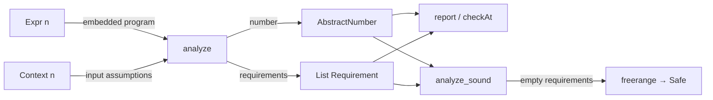

# FreeRange Lean

[](https://github.com/alok/freerange-lean/actions/workflows/ci.yml)

FreeRange Lean is a pure Lean 4 range analyzer with an end-to-end soundness theorem. Give
it an embedded exact-integer expression and abstract ranges for its inputs; it computes:

- an abstract number containing every successful result; and
- the nonzero requirements needed to make division safe.

The analyzer is executable. The guarantee is proved. `analyze_sound` connects every
computed result to the concrete `Expr.eval` semantics, while the `freerange` tactic turns
a requirement-free analysis into a theorem of total evaluation.

FreeRange Lean is inspired by Cheng Lou's
[FreeRange](https://github.com/chenglou/freerange), but it is an independent Lean library,
not a TypeScript bridge. Its theorems concern unbounded mathematical `Int` values—not
JavaScript binary64, machine integers, or arbitrary Lean source.

## Quickstart: analyze and prove

Add `FreeRange` to a Lean file and construct one input, one context, and one expression:

```lean
import FreeRange

open FreeRange

namespace Example

def x : Var 1 := .at 0

def unconstrained : Context 1 := .uniform .top

def guardedDivision : Expr 1 :=
  ifE (x ≠ᵍ 0) (10 / x) 0

#eval IO.println (report unconstrained guardedDivision)
-- range: [-∞, +∞]
-- requires: none

example : Safe unconstrained guardedDivision := by
  freerange

end Example
```

`Safe context expression` means that evaluation succeeds for every concrete environment
covered by `context`. The proof works because the true branch refines `x` to exclude zero
before the divisor is analyzed. `freerange` applies the proved safety corollary and closes
the computed empty-requirements equality by kernel reduction; it does not test sample inputs.

The same refinement survives an exact shift:

```lean
def shiftedDivision : Expr 1 :=
  ifE (x ≠ᵍ 4) (10 / (x - 4)) 0

example : Safe unconstrained shiftedDivision := by
  freerange
```

Changing the guard to `x ≠ᵍ 5` correctly leaves `(x0 - 4) != 0` as a caller
requirement.

Every definition and claim in this quickstart has a compiled counterpart in
[`Test/Quickstart.lean`](Test/Quickstart.lean). That module uses exact `#guard`
expectations so documentation drift fails the test suite.

## Bounded analysis

Exactly sized vectors avoid raw `Fin` functions for ordinary contexts:

```lean
def x2 : Var 2 := .at 0
def y2 : Var 2 := .at 1

def boundedPair : Context 2 :=
  .ofVector #v[.closed 1 10, .closed 2 3]

#eval IO.println (report boundedPair (x2 + y2))
-- range: [3, 13]
-- requires: none

#eval IO.println (report boundedPair (x2 * y2))
-- range: [2, 30]
-- requires: none
```

Finite bounded multiplication uses the standard four endpoint products. For
`[a, b] * [c, d]`, the result is the interval from the minimum to the maximum of
`a*c`, `a*d`, `b*c`, and `b*d`. `Interval.mem_productHull` proves that every
concrete product belongs to that interval.

## Named reports and concrete checks

Default reports retain the stable names `x0`, `x1`, and so on. Presentation names can be
supplied without changing the analyzed expression or theorem:

```lean
def crossesZero : Context 1 := .singleton (.closed (-5) 5)

def divisorName : InputNames 1 := .singleton "divisor"

#eval IO.println (reportWithNames crossesZero (10 / x) divisorName)
-- range: [-∞, +∞]
-- requires: divisor != 0

#eval IO.println (
  (checkAt crossesZero (10 / x) (.singleton 0)).renderWithNames divisorName)
-- requirement failed: divisor != 0

#eval IO.println (
  (checkAt crossesZero (10 / x) (.singleton 2)).renderWithNames divisorName)
-- value: 5
```

`checkAt` checks context membership, then inferred requirements, then concrete evaluation
for one supplied environment. It is an explanation tool, not a counterexample search and
not the basis of the proof.

## How the pieces fit



The language in `Expr n` contains:

- integer constants and inputs indexed by `Fin n`;
- negation, addition, subtraction, multiplication, and partial integer division;
- `minE`, `maxE`, and `absE`; and
- `ifE` with one input-to-constant guard.

`Var n` coerces to `Expr n`. Mixed `Var`/`Expr` operands support ordinary `+`, `-`,
`*`, and `/` notation. Guards deliberately use distinct symbols:

```lean
x =ᵍ 3
x ≠ᵍ 3
x <ᵍ 3
x ≤ᵍ 3
x >ᵍ 3
x ≥ᵍ 3
```

## Abstract numbers and canonical form

The public constructors are:

```lean
AbstractNumber.top
AbstractNumber.closed lower upper
AbstractNumber.atLeast lower
AbstractNumber.atMost upper
AbstractNumber.exact value
```

An abstract number is an inclusive, possibly unbounded interval with at most one excluded
integer. Empty bounded intervals represent unreachable refinements.

`AbstractNumber.normalize` removes an exclusion that lies outside its interval. The theorem
`mem_normalize_iff` proves exact membership equivalence, and
`normalize_isNormalized` proves the canonical-form invariant. Public transformers normalize
their outputs, and rendering normalizes even a manually constructed noncanonical value, so
reports never emit noise such as `[3, 5] except 0`.

## The soundness contract

The central theorem is:

```lean
theorem analyze_sound
    (context : Context inputCount)
    (expression : Expr inputCount)
    (environment : Env inputCount)
    (hcontext : context.Covers environment)
    (hrequirements :
      Requirements.Hold (analyze context expression).requirements environment) :
    ∃ value,
      expression.eval environment = some value ∧
      (analyze context expression).number.Mem value
```

It proves evaluation safety and result containment together. A report with requirements is
a conditional theorem: callers must establish those requirements for the environment at
hand.

The tactic uses this corollary:

```lean
theorem safe_of_no_requirements
    (hrequirements : (analyze context expression).requirements = []) :
    Safe context expression
```

Every transformer used by `analyze` has a local membership theorem, including joins,
guard refinements, canonicalization, and the finite multiplication hull.

## Precision, honestly

Soundness does not imply maximal precision. Version 0.2.0 deliberately uses a small,
auditable nonrelational domain:

| Operation | Abstract behavior |
| --- | --- |
| Constants and inputs | Exact constant or caller-supplied abstract number |
| Negation, addition, subtraction | Interval image, retaining the zero-exclusion facts needed by guarded division |
| Multiplication | Exact scaling for a singleton; four-corner hull for two finite intervals; top interval for an unbounded nonconstant pair |
| `minE`, `maxE`, `absE` | Proved interval images; excluded-point detail may be forgotten |
| Division | Prove or infer a nonzero divisor requirement, then return the top interval |
| `ifE` | Refine each branch, join result ranges, and combine requirements path-insensitively |

Multiplication excludes zero when both operands prove zero absent, including on the
unbounded fallback. A single nonzero factor is insufficient because the other factor may be
zero.

The domain stores only one excluded point. Requirements are not deduplicated or simplified,
and both branches contribute requirements even when one is unreachable for a particular
concrete input. These choices can widen a result or strengthen a caller contract; they never
authorize a false range claim.

## Install

For a released dependency, add this to `lakefile.lean`:

```lean
require FreeRange from git
  "https://github.com/alok/freerange-lean" @ "v0.2.0"
```

Then:

```lean
import FreeRange
```

The release is pinned to `leanprover/lean4:v4.32.0` and has no third-party Lean
dependencies. Pinning the tag is recommended for reproducible proofs; use `main` only when
you intentionally want unreleased changes.

To inspect or contribute locally:

```text
git clone https://github.com/alok/freerange-lean.git
cd freerange-lean
lake build --wfail
lake test
lake exe freerange
```

The executable prints canonical examples and exits nonzero if an expected report changes.

## Trust and verification

The Lean source contains no `sorry`, `admit`, custom `axiom`, or `unsafe` declaration.
With the pinned toolchain, `#print axioms` reports only:

```text
'FreeRange.analyze_sound' depends on axioms: [propext, Classical.choice, Quot.sound]
'FreeRange.safe_of_no_requirements' depends on axioms: [propext, Classical.choice, Quot.sound]
```

The representative theorem produced by `freerange` has the same audit. CI runs:

```text
lake build --wfail
lake test
lake exe freerange
lake env leanchecker
lake build +Test.Axioms --wfail
```

The detailed model and trust boundary live in [`SEMANTICS.md`](SEMANTICS.md).

## Repository map

| Path | Role |
| --- | --- |
| [`FreeRange/Range.lean`](FreeRange/Range.lean) | Bounds, intervals, exclusions, transformers, normalization, and local proofs |
| [`FreeRange/Expr.lean`](FreeRange/Expr.lean) | Embedded syntax, concrete semantics, variables, contexts, and environments |
| [`FreeRange/Analyze.lean`](FreeRange/Analyze.lean) | Guard refinement, requirements, and executable abstract interpretation |
| [`FreeRange/Soundness.lean`](FreeRange/Soundness.lean) | Refinement proofs and whole-analyzer soundness |
| [`FreeRange/Report.lean`](FreeRange/Report.lean) | Stable/default/named reports and concrete checks |
| [`FreeRange/Tactic.lean`](FreeRange/Tactic.lean) | The `freerange` tactic |
| [`Test/Quickstart.lean`](Test/Quickstart.lean) | Compiled public walkthrough |
| [`Test/`](Test) | Proof, precision, output, negative, and axiom regressions |
| [`Main.lean`](Main.lean) | Self-checking command-line demonstration |

The original 0.1 contract is [`SPEC.md`](SPEC.md); the 0.2.0 extension is
[`POLISH_SPEC.md`](POLISH_SPEC.md). See [`CHANGELOG.md`](CHANGELOG.md) for release
history, [`CONTRIBUTING.md`](CONTRIBUTING.md) for development rules, and
[`UPSTREAM.md`](UPSTREAM.md) for precise attribution and design comparison.

## Scope and non-goals

FreeRange Lean 0.2.0 does not:

- inspect arbitrary Lean declarations or compiler IR;
- prove claims about JavaScript, IEEE-754, Lean `Float`, C `double`, or fixed-width overflow;
- model arrays, mutable state, loops, recursion, or cross-function summaries;
- maintain relational facts between two unknown inputs; or
- search automatically for counterexamples.

Extending one of those boundaries requires a concrete semantics, matching abstract
transformers, and a theorem connecting them. Similar-looking source code is not enough.

## Citation, attribution, and license

Software citation metadata is available in [`CITATION.cff`](CITATION.cff). FreeRange Lean
is MIT licensed; the upstream FreeRange project is also MIT licensed. Copyright and the
exact design-comparison revision are documented in [`UPSTREAM.md`](UPSTREAM.md).
